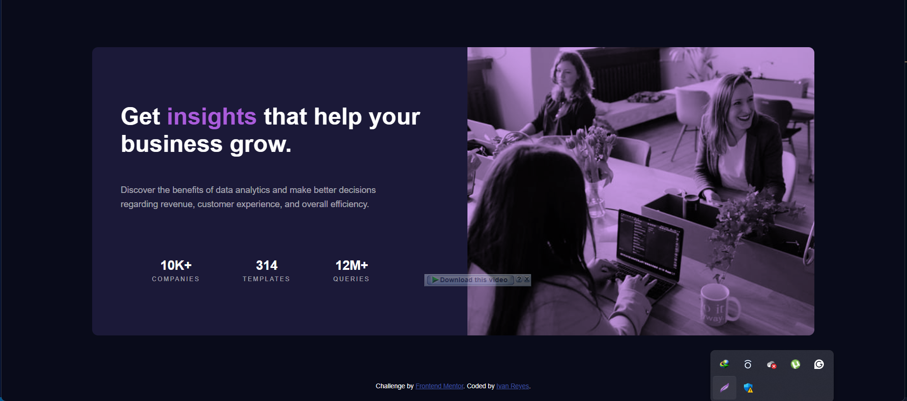

# Frontend Mentor - Stats preview card component solution

This is a solution to the [Stats preview card component challenge on Frontend Mentor](https://www.frontendmentor.io/challenges/stats-preview-card-component-8JqbgoU62). Frontend Mentor challenges help you improve your coding skills by building realistic projects. 

## Table of contents

- [Overview](#overview)
  - [The challenge](#the-challenge)
  - [Screenshot](#screenshot)
  - [Links](#links)
- [My process](#my-process)
  - [Built with](#built-with)
  - [What I learned](#what-i-learned)
  - [Continued development](#continued-development)
  - [Useful resources](#useful-resources)
- [Author](#author)
- [Acknowledgments](#acknowledgments)

## Overview

### The challenge

Users should be able to:

- View the optimal layout depending on their device's screen size

### Screenshot

### Links

- Solution URL: [Add solution URL here](https://github.com/van3030/stats-preview-card-component)
- Live Site URL: [Add live site URL here](https://your-live-site-url.com)

## My process

### Built with

- Semantic HTML5 markup
- CSS custom properties
- Flexbox
- CSS Grid
- Mobile-first workflow

### What I learned

I learned some picture of flexbox flex: 1 flex: 2 and also column-reverse and also learned how to used mix-blend mode,and also this is the first time I used height: 100dvh;

### Continued development

actually I stil need to continue all the feature of CSS flexbox,Grid,pseudo-element,media@

### Useful resources
 yt, w3schools

## Author

- Frontend Mentor - [@van3030](https://www.frontendmentor.io/profile/yourusername)

## Acknowledgments

Thanks to Kim does code yt tutorial
